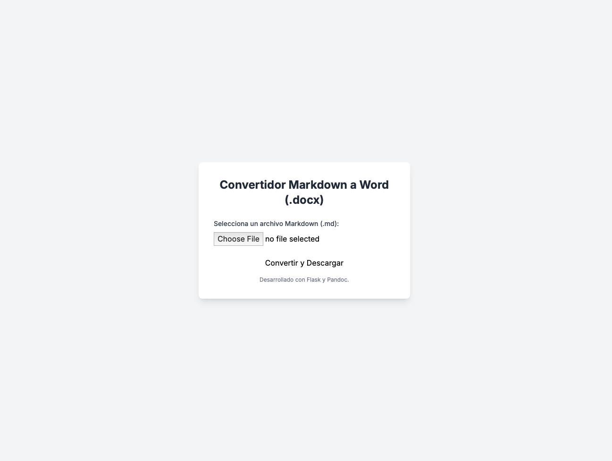

# Markdown to Word (.docx) Converter

Convert Markdown files to Word (.docx) files using [pypandoc](https://github.com/JessicaTegner/pypandoc) and [Flask](https://flask.palletsprojects.com/).



## Requirements

- Python 3.10+
- Pandoc
- Flask

## Usage
### Local
1. Clone the repository:

```bash
git clone https://github.com/gutirodrii/md-to-docx.git
```

2. Install the dependencies:

```bash
pip install -r requirements.txt
```

3. Run the app:

```bash
python -m flask run
```
### Docker (Recommended)
1. Build the Docker image:

```bash
docker build -t md-to-docx .
```

2. Run the Docker container:

```bash
docker run -p 5000:5000 md-to-docx
```

3. Access the app at http://localhost:5000.

## License
[MIT](LICENSE)